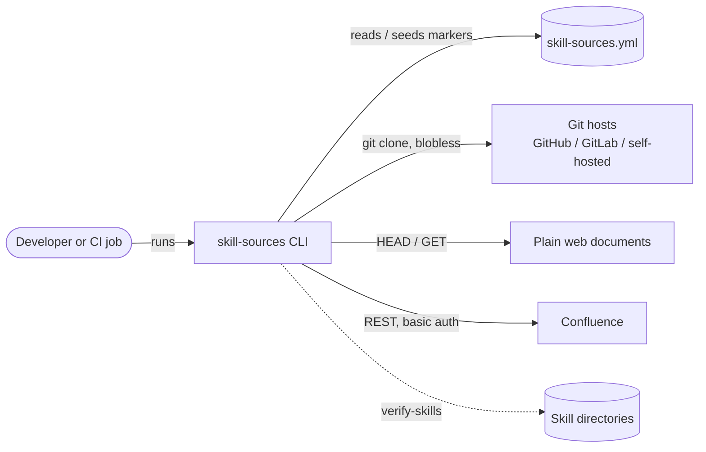

# Architecture

`skill-sources` is a single-run CLI: it reads one manifest, asks each
declared upstream for its current marker, compares against what a human last
reviewed, prints a report, and exits with a meaningful code. There is no
daemon, no state beyond the manifest itself, and no write path to anything
except the manifest's `last-reviewed` fields. Decisions that shaped this are
recorded in [docs/adr](docs/adr/README.md); the manifest format itself is
specified in [CONVENTION.md](CONVENTION.md).

## Context

Nothing else is contacted. The tool sends no telemetry, calls no registry at
runtime, and talks only to the upstreams the manifest names, using
credentials the caller already holds.

## Components

`bin/cli.mjs` owns argument parsing, output rendering and the exit-code
contract; it holds no resolution logic. `src/manifest.js` parses, validates
and flattens the manifest — loaded as a YAML document rather than plain data
so `seed` can write markers back without destroying comments or formatting —
and owns the entry addressing that write-back uses. `src/check.js` is the
engine: it resolves entries concurrently under a bounded worker pool and
classifies each as `fresh`, `drifted`, `unreviewed`, `missing` or `error`.
`src/skills.js` implements `--verify-skills` with a deliberately small,
linear-time glob dialect. Each file in `src/resolvers/` turns one locator
type into an opaque marker behind the same minimal interface — `resolve`,
optionally `exists` and `cleanup` — and adding a source type means adding
one such file and nothing else.

## Trust and security posture

The threat model is a tool run inside other people's CI. Credentials are
never taken as values: git sources use whatever the caller's git is already
configured with, and Confluence credentials are read from environment
variables whose *names* the flags select, so no secret reaches `argv`, the
manifest, or the output. Error messages are sanitised to git's own diagnosis
so temporary paths and command lines stay out of CI logs. Git clones are
blobless, ephemeral and removed after the run. User-supplied globs are
matched in linear time, closing the ReDoS surface a regex-built matcher
would open. The runtime dependency surface is one library (`yaml`), and
releases are published only from CI with OIDC trusted publishing and npm
provenance — no long-lived publish credential exists.

## Failure semantics

Exit codes are part of the interface: 0 means everything fresh, 1 means
something needs a human (drift, an unreviewed marker, a gone path, a skill
missing from disk), 2 means the run itself could not answer (unresolvable
source, bad invocation). An unresolvable source fails the gate rather than
passing, because absence of evidence is not evidence the skill is current.
A failing source is isolated to its own entry; it never aborts the run.

## Known gaps

Tracked honestly in
[#13](https://github.com/IsmaelMartinez/skill-sources/issues/13): the
Confluence and URL resolvers are covered by mocked fetches only, the CI
recipes in the README are reasoned-through YAML rather than executed
pipelines, and the blobless-clone behaviour is verified manually because
git ignores `--filter` for local clones. Per-ref clone duplication is
[#17](https://github.com/IsmaelMartinez/skill-sources/issues/17).
